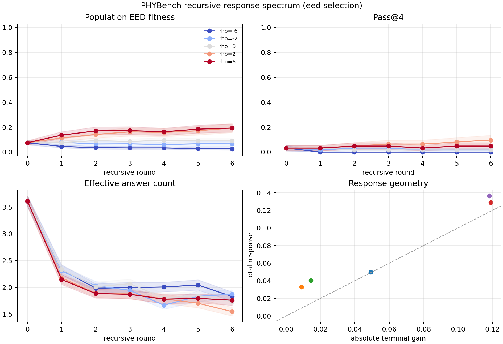
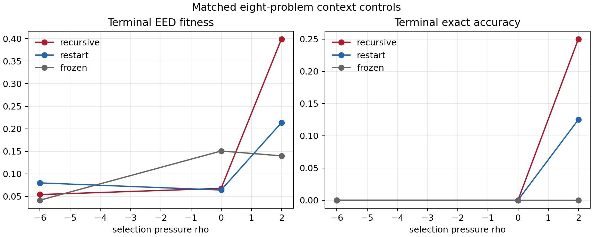

# Physics Response Spectrum Results

## Status

Completed on July 19--20, 2026. All AWS generation runs, matched context
controls, deterministic scoring, bootstrap analysis, and artifact generation
finished successfully. No AWS process remains active.

## Headline result

The fixed-weight Nova Lite system produced all three intended regimes under a
single selection parameter:

- **collapse:** strong negative selection, $\rho=-6$;
- **near-neutral behavior:** score-blind selection, $\rho=0$;
- **improvement:** positive selection, especially $\rho=2$ and $\rho=6$.

The primary EED fitness changed from the shared initial value $Q_0=0.0749$ to

| $\rho$ | Terminal EED $Q_6$ | Gain $g=Q_6-Q_0$ | Terminal exact accuracy | Terminal pass@4 |
|---:|---:|---:|---:|---:|
| $-6$ | 0.0257 | -0.0492 | 0.00% | 0.00% |
| $-2$ | 0.0659 | -0.0090 | 1.61% | 1.61% |
| $0$ | 0.0892 | +0.0143 | 0.40% | 1.61% |
| $2$ | 0.1939 | **+0.1190** | **8.87%** | **9.68%** |
| $6$ | 0.1930 | **+0.1181** | 4.84% | 4.84% |

This is a response spectrum, but not an autonomous weight-level takeoff. Nova
Lite's weights were fixed, the selector used a hidden answer key, and most of
the continuous signal is expression similarity rather than certified physical
correctness.

## What ran

The primary run used 31 PHYBench spectrum problems, two paired replicates, four
candidates per population, six recursive rounds, and

$$
\rho\in\{-6,-2,0,2,6\}.
$$

Every $\rho$ condition within a problem and replicate began from the same saved
round-zero population. At each later round, Nova Lite revised each selected
parent and the four children were resampled with replacement according to

$$
p_i(\rho)=
\frac{\exp\!\left[\rho(s_i-\tfrac12)\right]}
{\sum_j\exp\!\left[\rho(s_j-\tfrac12)\right]}.
$$

The primary made 7,688 Nova Lite calls. A matched eight-problem subset then ran
restart and frozen-context controls at $\rho\in\{-6,0,2\}$.

## Why the fitness changed after the first pilot

The preregistered exact-answer pilot produced zero exact answers at every
$\rho$ and round. With no fitness variation, its selection was effectively
uniform and could not distinguish collapse from improvement.

Before making fallback calls, the protocol was amended to use PHYBench's
normalized Expression Edit Distance (EED) as selection fitness:

$$
s_{\mathrm{EED}}=
\begin{cases}
1, & d=0,\\
\max\!\left(0,0.6-\dfrac{d}{L}\right), & d>0,
\end{cases}
$$

where $d$ is extended expression-tree edit distance and $L$ is the gold tree
size. Exact symbolic accuracy remained an independent outcome.

The first JSON pilot also exposed malformed LaTeX and truncation. Forced
Bedrock tool use reduced output length and eliminated ordinary JSON corruption;
bounded retries handled Nova's transient invalid-tool-use responses. These
gates are preserved under `runs/` and are not included in the primary estimates.

## Roundwise trajectory

Mean EED fitness by recursive round was:

| $\rho$ | $Q_0$ | $Q_1$ | $Q_2$ | $Q_3$ | $Q_4$ | $Q_5$ | $Q_6$ |
|---:|---:|---:|---:|---:|---:|---:|---:|
| $-6$ | .0749 | .0455 | .0352 | .0334 | .0336 | .0270 | .0257 |
| $-2$ | .0749 | .0791 | .0649 | .0663 | .0604 | .0667 | .0659 |
| $0$ | .0749 | .0760 | .0921 | .0850 | .0949 | .0891 | .0892 |
| $2$ | .0749 | .1130 | .1414 | .1626 | .1578 | .1713 | .1939 |
| $6$ | .0749 | .1360 | .1701 | .1723 | .1632 | .1842 | .1930 |

The qualitative separation appeared in the first round and persisted. The two
positive conditions saturated at nearly the same terminal EED, while $\rho=2$
finished with more exact answers than $\rho=6$. That nonmonotonic exact endpoint
is consistent with an exploration--concentration tradeoff, but this experiment
does not establish that mechanism.

## Statistical uncertainty

Problems, rather than individual candidates or duplicated survivors, were the
bootstrap units. Replicates were averaged within each problem. Percentile
intervals used 10,000 deterministic bootstrap draws.

| $\rho$ | EED endpoint gain | 95% problem-bootstrap interval | Terminal EED minus $\rho=0$ | 95% interval |
|---:|---:|---:|---:|---:|
| $-6$ | -0.0492 | **[-0.0894, -0.0163]** | -0.0636 | **[-0.1074, -0.0256]** |
| $-2$ | -0.0090 | [-0.0292, 0.0075] | -0.0233 | [-0.0551, 0.0030] |
| $0$ | +0.0143 | [-0.0064, 0.0363] | 0 | [0, 0] |
| $2$ | +0.1190 | **[0.0510, 0.2014]** | +0.1047 | **[0.0387, 0.1913]** |
| $6$ | +0.1181 | **[0.0669, 0.1772]** | +0.1038 | **[0.0537, 0.1652]** |

At $\rho=2$, exact accuracy gained 0.0766 with a 95% problem-bootstrap
interval of **[0.0081, 0.1653]**. The corresponding $\rho=6$ exact gain was
0.0363 with interval [0, 0.0927]. Thus the strongest exact result was positive
but concentrated: at the terminal round, $\rho=2$ had 22 correct survivor
slots across four unique problems, versus three correct slots from one problem
at round zero.

## Response geometry

For

$$
A(\rho)=\sum_{r=1}^{6}|Q_r-Q_{r-1}|,
\qquad
E(\rho)=A(\rho)-|g(\rho)|,
$$

the observed geometry was:

| $\rho$ | Terminal gain $g$ | Total response $A$ | Erased response $E$ | Negative steps |
|---:|---:|---:|---:|---:|
| $-6$ | -0.0492 | 0.0498 | 0.0006 | 5 |
| $-2$ | -0.0090 | 0.0329 | 0.0240 | 3 |
| $0$ | +0.0143 | 0.0403 | 0.0260 | 2 |
| $2$ | +0.1190 | 0.1288 | 0.0098 | 1 |
| $6$ | +0.1181 | 0.1364 | 0.0182 | 1 |

Strong negative selection produced almost monotone collapse. The neutral and
weak-negative trajectories had small endpoints but considerable erased motion.
Positive selection produced large, mostly retained response.

## Context controls

The controls reused the exact same round-zero populations for the first eight
primary problems and replicate zero.

- **Recursive:** each child saw its selected parent.
- **Restart:** every child solved from the problem alone.
- **Frozen:** each slot repeatedly saw its assigned round-zero attempt.

| Mode | $\rho=-6$ gain | $\rho=0$ gain | $\rho=2$ gain | $\rho=2$ terminal exact |
|---|---:|---:|---:|---:|
| Recursive | -0.0496 | -0.0360 | **+0.2951** | **25.0%** |
| Restart | -0.0238 | -0.0396 | +0.1098 | 12.5% |
| Frozen | -0.0621 | +0.0469 | +0.0362 | 0.0% |

At $\rho=2$, the recursive terminal EED exceeded restart by 0.1853, but its
eight-problem bootstrap interval [-0.2224, 0.5664] crossed zero. It exceeded
frozen context by 0.2589 with interval [0.0508, 0.5152]. This is suggestive
evidence that inherited context can amplify positive selection, but the control
subset had one replicate and only eight problems. Restart also improved
substantially, demonstrating that repeated generation plus oracle selection
explains part of the spectrum.

## Diversity and domain effects

Effective answer count fell from 3.61 of 4 initially to:

| $\rho$ | Terminal distinct fraction | Terminal effective answers |
|---:|---:|---:|
| $-6$ | 0.500 | 1.83 |
| $-2$ | 0.520 | 1.87 |
| $0$ | 0.476 | 1.74 |
| $2$ | 0.423 | **1.55** |
| $6$ | 0.480 | 1.76 |

All conditions concentrated because selection sampled with replacement.
$\rho=2$ produced the largest accuracy gain and the strongest terminal
concentration.

The clearest positive domain was electricity: its $\rho=2$ EED gain was
+0.2257 and terminal exact accuracy was 25%. Mechanics gained +0.0724 EED but
had no exact terminal answers. Thermodynamics gained +0.0617 and reached 6.25%
exact. Optics lost 0.0375 at $\rho=2$, but it contained only two problems.
Advanced and modern physics each contained one problem, so their domain curves
are descriptive only.

## Reliability and cost

Primary-run quality:

- 7,688 calls and candidates;
- 8,957,085 input tokens and 2,402,113 output tokens;
- 4 terminal API failures after all retries, or 0.052%;
- 39 unusable structured outputs, or 0.51%, including API failures;
- 685 candidate expression parse failures, or 8.91%;
- 161 exactly correct generated candidates across five unique problems;
- 81 candidates required at least one tool-use retry.

All smoke tests, pilots, gates, the primary, and both controls together used:

- **9,849 Bedrock calls**;
- 11,015,693 input tokens and 3,285,813 output tokens;
- **$1.4495367 estimated spend** at $0.06 per million input tokens and $0.24
  per million output tokens.

This is a token-based estimate recorded by the experiment ledger, not an AWS
invoice. It remained far below the authorized $10 budget and the $9.50 hard
stop.

## Interpretation and stopping decision

The experiment establishes a controlled inference-time response spectrum:
negative oracle selection collapses solution quality, neutral propagation
mostly churns, and positive oracle selection improves both EED and exact
accuracy while reducing diversity.

It does **not** establish autonomous recursive self-improvement:

- model weights never changed;
- an external selector used the hidden gold answer;
- restart improved too, so recursive inheritance is not the whole effect;
- exact success was concentrated in a small number of problems;
- EED can reward structural resemblance without physical correctness.

No fine-tuning job was launched. Only five unique primary problems generated
exact answers, far short of the planned 200 diverse, audited training examples.
Spending the fine-tuning reserve would therefore test memorization of a narrow
set rather than credible held-out improvement. No further AWS calls are
scientifically justified without a new preregistered replication or a broader
verified training set.

## Artifacts

- [Six-page standalone manuscript](physics_response_spectrum.pdf)
- [Manuscript LaTeX source](physics_response_spectrum.tex)
- [Primary manifest](runs/primary-eed-tool-20260719/manifest.json)
- [Primary terminal summary](runs/primary-eed-tool-20260719/terminal_summary.csv)
- [Primary round aggregates](runs/primary-eed-tool-20260719/aggregate.csv)
- [Primary raw candidates](runs/primary-eed-tool-20260719/candidates.jsonl)
- [Restart control](runs/control-restart-20260719/terminal_summary.csv)
- [Frozen-context control](runs/control-frozen-20260719/terminal_summary.csv)
- [Bootstrap estimates](results/paired_bootstrap.csv)
- [Context-control comparisons](results/context_controls.csv)
- [Domain summaries](results/domain_terminal.csv)
- [Machine-readable analysis](results/analysis_summary.json)
- [Append-only AWS usage ledger](usage_ledger.csv)
